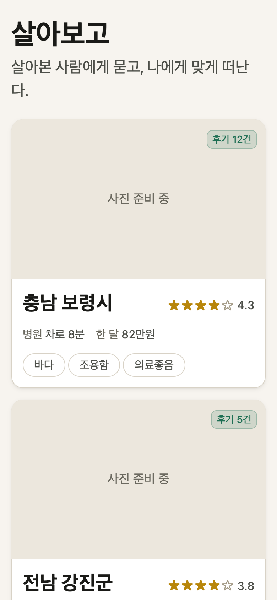

# SARABOGO (살아보고)

[한국어](README_KO.md)

> **"Ask someone who has lived there, then leave on your own terms."**

A month-long-stay platform for Korean seniors — built on verified, structured reviews and Korea Tourism Organization open data. Entry for the **2026 Tourism Data Contest** (web/app track).

**Live demo:** https://sarabogo.vercel.app

<p align="center">
  
</p>

## Why

Korean local governments run dozens of "live here for a month" support programs, but the information is scattered and reviews are unverifiable. Existing travel services answer *"what is there to see?"* — SARABOGO asks the same open data a different question: *"can I actually live here for a month?"*

So a region card leads with **life metrics**, not tourist photos:

> Boryeong-si · Hospital 8 min by car · ₩820,000/month · 12 reviews ★4.3

## Features (MVP)

| # | Feature | Detail |
|---|---------|--------|
| 1 | **Region explorer** | KTO TourAPI data re-edited into senior-relevant indicators (hospitals, pharmacies, cost, terrain) on a Kakao map |
| 2 | **Structured reviews** | Per-item star ratings (medical access, cost, community, transit, revisit intent) instead of free-text blogs |
| 3 | **Evidence-based AI courses** | LLM generates weekly stay plans grounded (RAG) in real reviews from our DB — every recommendation cites its source reviews |
| 4 | **KakaoTalk sharing** | Send results to family with one tap |

## Design principles

- **Honest nulls.** Review ratings are nullable. If a source document doesn't mention transit, the card says *"정보 없음" (no data)* — never a fabricated star. Averages exclude nulls; `null` is never coerced to `0`. Enforced in the DB (CHECK constraints), the aggregation layer, and the UI.
- **No scraping — provenance as a feature.** Cold-start reviews come only from **KOGL Type-1 public documents** (freely reusable with attribution under Korean copyright law §24-2) or individually licensed authors. Every seeded review carries a source badge. The admin console is a *policy gate*: the curated-facts form has no paste-the-original field at all.
- **Ports & adapters.** DB (`DbPort`), LLM (`LlmPort`), and geocoding (`GeocodePort`) are vendor-isolated. The same contract test suite passes against both the in-memory fake and live Supabase — swappability is proven, not claimed. ESLint blocks vendor SDK imports outside `adapters/`.
- **Senior-safe social feed.** Instagram-style card feed, minus the anti-patterns: no infinite scroll (10 items + "더 보기" button), icon+label tabs, 18px+ body text, WCAG AA contrast from a single token file.

## Tech stack

| Layer | Choice |
|-------|--------|
| Frontend + API | Next.js (App Router), Tailwind v4, PWA |
| DB / Auth / RLS | Supabase (PostgreSQL) via `DbPort` adapter |
| AI | Claude API (default) / OpenAI — swappable via `LLM_PROVIDER` |
| Map | Kakao Maps JS SDK + Kakao Local geocoding |
| Data | KTO TourAPI 4.0 · HIRA hospital/pharmacy API |
| Deploy | Vercel |

## Getting started

```bash
git clone https://github.com/daehyub71/sarabogo.git
cd sarabogo
npm install
cp .env.example .env   # fill in your API keys
npm run dev            # http://localhost:3000
```

Verify everything:

```bash
npm run validate                 # lint + typecheck + tests
node scripts/check-keys.mjs      # live-checks every external API key
```

Apply the DB schema to your Supabase project:

```bash
psql "$SUPABASE_DB_URL" -f supabase/migrations/0001_init.sql
psql "$SUPABASE_DB_URL" -f supabase/migrations/0002_rls.sql
```

## Project structure

```
src/
├── app/                  # Next.js App Router pages + API routes
├── components/           # RegionCard, FeedList, ui/ primitives
├── lib/
│   ├── kto.ts            # KTO TourAPI client (MobileApp id auto-injected)
│   ├── hira.ts           # HIRA hospital/pharmacy client (XML, coords included)
│   ├── db/               # DbPort + adapters/ (supabase, memory)
│   ├── llm/              # LlmPort + adapters/ (anthropic, openai)
│   ├── geocode/          # GeocodePort + adapters/ (kakao, table fallback)
│   ├── authz.ts          # App-layer authorization (1st boundary; RLS is 2nd)
│   └── reviews*.ts       # Review write service + null-safe aggregation
├── styles/tokens.css     # Single source of design tokens (senior a11y)
supabase/migrations/      # Schema + RLS (review origin CHECK constraints)
tests/                    # vitest — incl. DbPort contract run on 2 adapters
scripts/                  # check-keys, shot (screenshot + overflow audit)
```

## Data compliance

- All KTO TourAPI calls go through `lib/kto.ts`, which injects the app identifier (`MobileApp=sarabogo`). Note: TourAPI has **no `AppName` parameter** — sending one fails every request (verified against the live API).
- Google Places data is never stored (only `place_id`, per policy). No platform scraping, by hand or by bot.
- Seeded reviews: KOGL Type-1 sources only, with mandatory attribution fields enforced by DB constraints.

## License

Contest entry — license to be determined. Tourism data © Korea Tourism Organization (KOGL).
